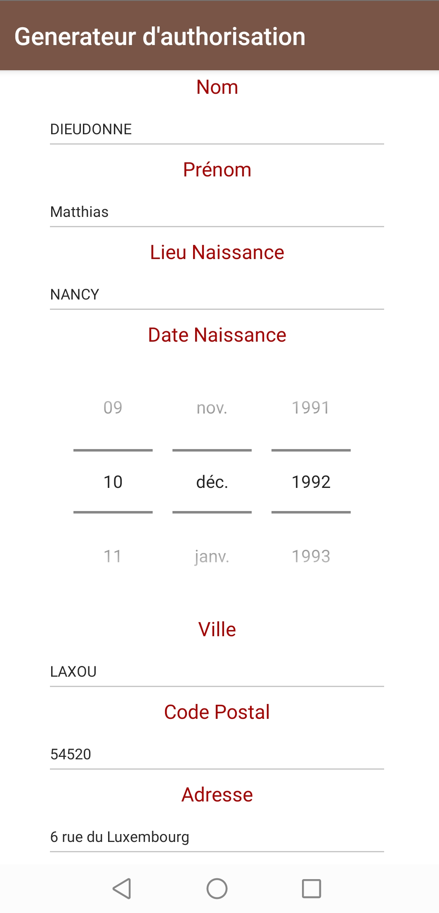
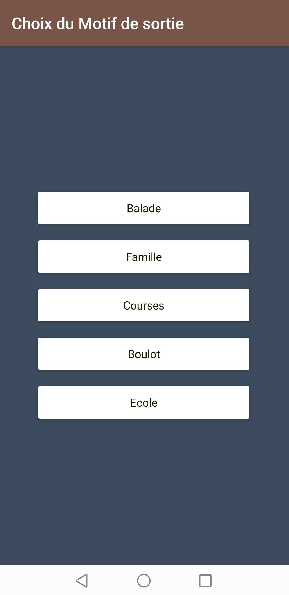

# Generateur d'authorisation de sortie

> Parce que le confinement c'est pas simple
> Parce que quand tu sort 4 fois ton chiens par jours
> Parce que c'est super relou de devoir retaper sur le site officiel toutes les infos et selectionner la date et l'heure et s'envoyer sur son smartphone

# Release (android)

- Disable google play protect : Play Store -> Menu button (right top button) -> Disable the options Scan device for security threats
- Télécharger la dernier release pour [android](https://github.com/MatthD/authorisation-generateur/releases/download/1.0.1/go-out-1.0.1.apk)
- Accepter lors de la demande d'installation d'app non verifiée par google

## Utilisation

1. Remplir toutes vos informations perso dans la partie mes infos (*une seule fois*)
2. Choisissez un motif dans la magnifique liste

enjoy votre PDF qui s'ouvre (il se trouve également dans `/storage/download` )

❤️Made with love in France with Nativescript, TypeScript & Vue/Vuex
